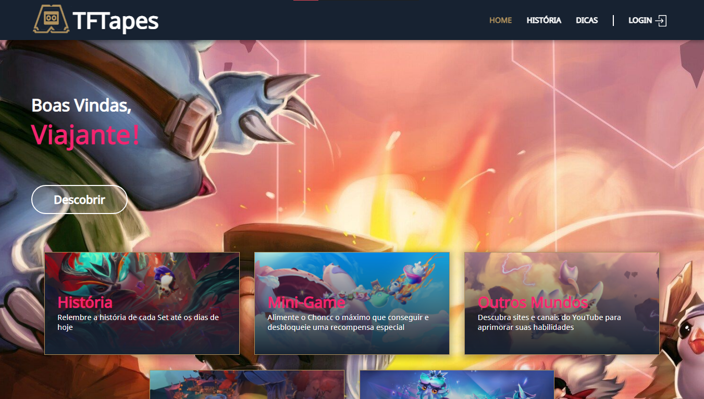
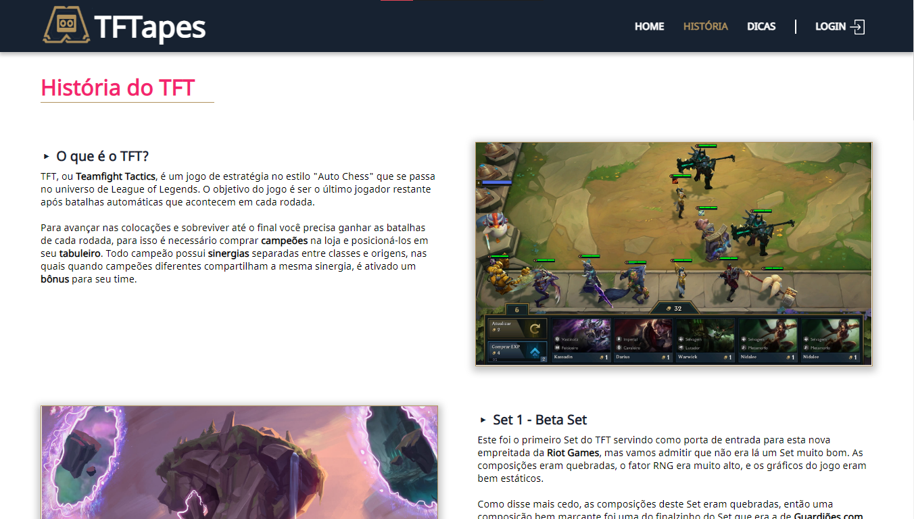
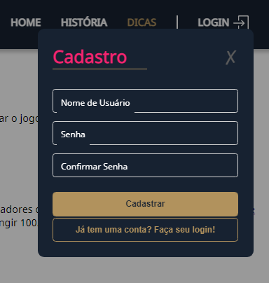
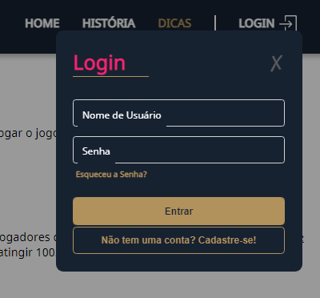
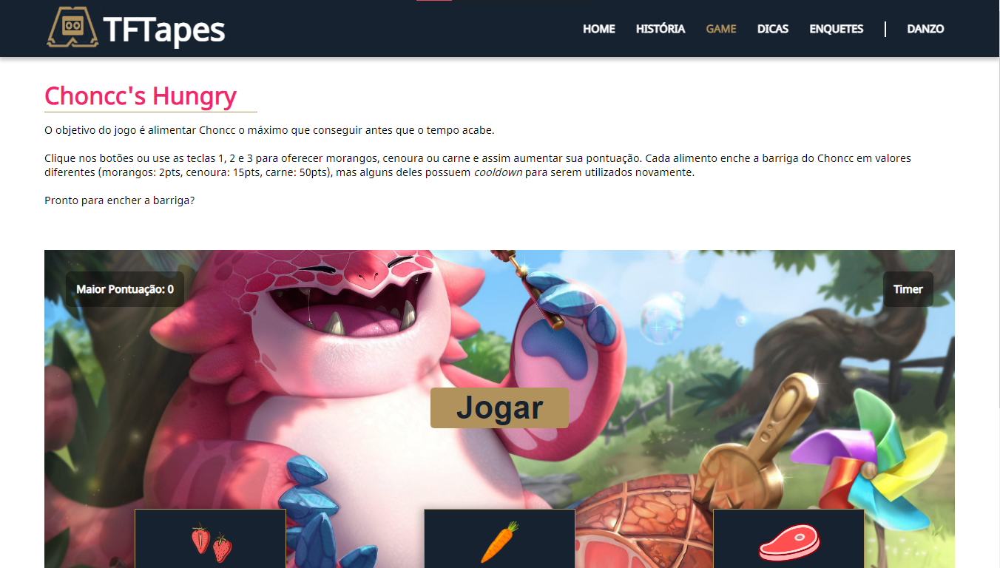
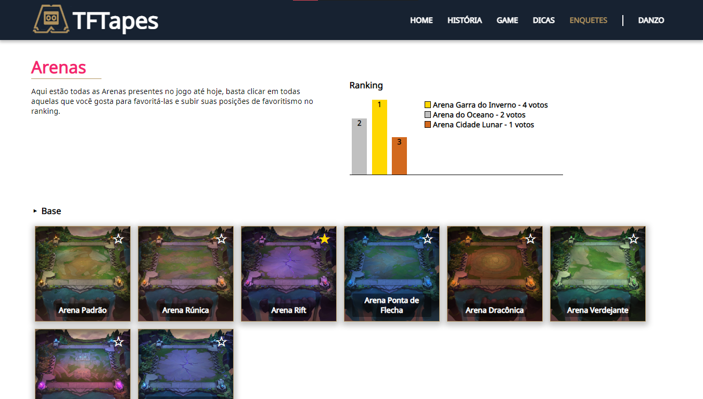
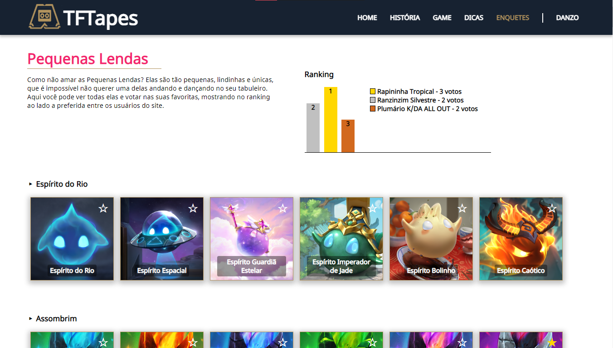
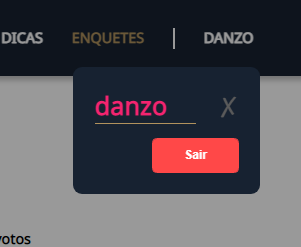

# TFTapes

## Sumário

- [Sobre](#sobre)
- [Começando](#comecando)
- [Utilização](#utilizacao)

## Sobre <a name = "sobre"></a>

TFTapes é um website desenvolvido em HTML/CSS/JS, com uma API em Node JS, e banco de dados SQL Server na nuvem Azure.

Seu objetivo é reunir em um único lugar aspectos do Teamfight Tactics (TFT) que muitas vezes são esquecidos pela comunidade, e assim trazer um valor maior para este jogo tão menosprezado por jogadores do League of Legends.

## Começando <a name = "comecando"></a>

Essas instruções fornecerão uma cópia do projeto instalado e funcionando em sua máquina local para fins de desenvolvimento e teste.

### Pré-requisitos
Antes de começar, você vai precisar ter instalado em sua máquina as seguintes ferramentas: Git, Node.js. Além disto, é bom ter um editor para trabalhar com o código como o VSCode.

Obs: Este projeto funciona somente em sistemas operacionais Windows.

### Instalando

Clone este repositório

```
$ git clone https://github.com/danzobiss/TFTapes.git
```

Acesse a pasta do projeto e do site no seu terminal/cmd

```
$ cd TFTapes/site
```

Instale as dependências

```
$ npm install
```

Crie um arquivo dentro do diretório json com o nome dadosConfidenciais.json

```
$ ./json/dadosConfidenciais.json
```

Adicione seus dados de usuário, senha, database e host para production e dev

```
$ {
    "production": {
        "username": "",
        "password": "",
        "database": "",
        "host": ""
    },
    "dev": {
        "username": "",
        "password": "",
        "database": ""
    }
}
```

Altere as linhas 1 e 15 para 'dev' ou 'production' em app.js

```
$ ./app.js;

# Linha 1 exemplo
$ process.env.NODE_ENV = 'production';

# Linha 15 exemplo
$ app.use(logger('production'));
```

Execute a aplicação em modo de desenvolvimento

```
$ npm start

# A aplicação será aberta na porta:3000 - acesse http://localhost:3000
```

No console do seu navegador, execute na página inicial as seguintes funções:

```
$ cadastrarClasse();
$ cadastrarArena();
$ cadastrarEspecie();
$ cadastrarPequenaLenda();
```



## Utilização <a name = "utilizacao"></a>

Logo na "Home" você é apresentado a todos as abas que podem ser acessadas no site.


Acessando a aba "História", é possível ler sobre o começo do TFT até os dias de hoje.


A aba "Dicas" apresenta meios de aprimorar suas habilidades no jogo.


Para ter acesso as outras abas é necessário realizar o cadastro e login.



Após realizar o seu login, você poderá acessar a aba "Game" e jogar um mini-game para passar seu tempo.


Uma das abas de enquetes é a de "Arenas", que podem ser favoritadas e, consequentemente, subindo sua posição no ranking.


A outra aba de enquetes é a das "Pequenas Lendas", que faz basicamente as mesmas funções da aba "Arenas".


Por fim, o usuário pode sair a qualquer momento clicando no seu nome na barra de navegação e em seguida em "Sair".

